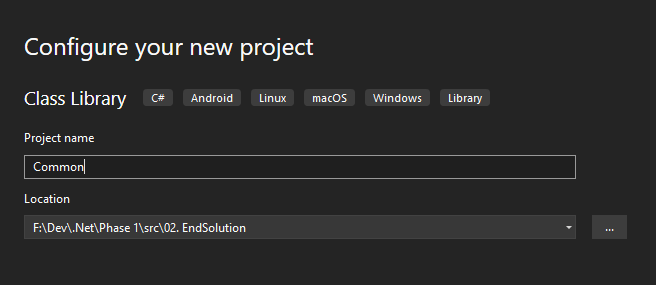
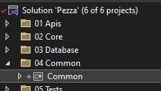
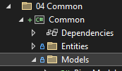
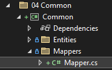
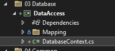
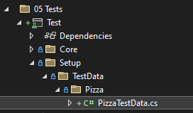
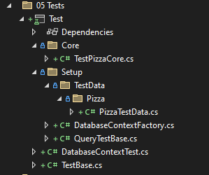
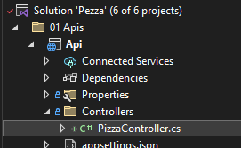
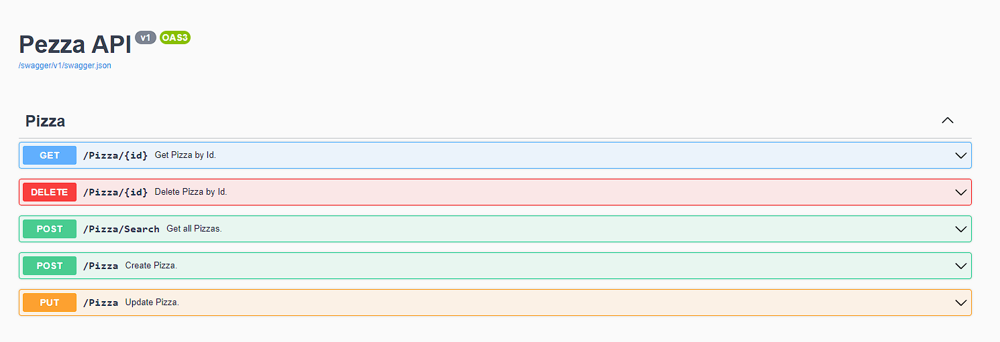

# &nbsp;**Pezza - Phase 1** [](https://github.com/entelect-incubator/.NET/actions/workflows/dotnet-phase1-finalsolution.yml)

<br/><br/>

We will be looking at creating a solution for Pezza's customers only. We will start with what a typical solution might look like and refactor it into a clean architecture that can be used throughout the rest of the incubator. We will only be focussing on the Pezza Stock for this Phase. This is to show the scaffold of a new solution and projects according to [.NET Clean Architecture](https://github.com/entelect-incubator/.NET-CleanArchitecture).

## **What you will be building in Phase 1**


## **Setup**

For the database we will be using InMemory Database that can be modified at a later stage to MSSQL, MySQL or Postgres.

Create a new Pezza Solution - CMD Run dotnet new sln


Create Clean Architecture Folder Structure in your new Solution as below.


## **Create the Common Layer**

This will contain all entities, enums, exceptions, interfaces and types.

**Nuget Packages Required**

- [ ] [Mapperly](https://github.com/riok/mapperly)

Create a new Class Library **Common** <br/>  <br/> 




Create a folder *Entities* where all database models will go into <br/> 

Create a Entity Pizza.cs in a folder **Entities** <br/>

Pizza.cs

```cs
namespace Common.Entities;

public class Pizza
{
    public int Id { get; set; }

    public string Name { get; set; }

    public string Description { get; set; }

    public decimal Price { get; set; }

    public DateTime DateCreated { get; set; }
}
```

Create a folder *Models* where all models will go into <br/>  


Create a model PizzaModel.cs in a folder **Models** <br/>


PizzaModel.cs

```cs
namespace Common.Models;

public class PizzaModel
{
    public int Id { get; set; }

    public string Name { get; set; }

    public string Description { get; set; }

    public decimal Price { get; set; }

    public DateTime DateCreated { get; set; }
}
```

Create a folder **Mappers**. Create a **Mapper.cs** declaration as a partial class and apply the Riok.Mapperly.Abstractions.MapperAttribute attribute. Mapperly generates mapping method implementations for the defined mapping methods in the mapper.. [What is Mapperly?](https://mapperly.riok.app/docs/intro) <br/> 



Mapper.cs

```cs
namespace Common.Mappers;

using Common.Entities;
using Common.Models;
using Riok.Mapperly.Abstractions;

[Mapper]
public static partial class Mapper
{
	public static partial PizzaModel Map(this Pizza pizza);
}
```

## **Create the Database Layer**

Create a new Class Library DataAccess <br/> .png)

For accessing the Database we will be using [Entity Framework Core](https://github.com/dotnet/efcore).

**Nuget Packages Required**
- [ ]  Microsoft.EntityFrameworkCore.Relational
- [ ]  Microsoft.EntityFrameworkCore.InMemory

DbSet will act as a Repository to the Database. You will see we have added SaveChangesAsync into the interface, this is to expose DbContext Entity Framework Core mffethods in your interface.

We need to create a DatabaseContext.cs inside of DataAccess. A [DbContext](https://docs.microsoft.com/en-us/dotnet/api/microsoft.entityframeworkcore.dbcontext?view=efcore-5.0) instance represents a session with the database and can be used to query and save instances of your entities. DbContext is a combination of the Unit Of Work and Repository patterns.



PizzaMap.cs under Mapping folder

```cs
namespace DataAccess.Mapping;

using Microsoft.EntityFrameworkCore;
using Common.Entities;

public sealed class PizzaMap : IEntityTypeConfiguration<Pizza>
{
	public void Configure(Microsoft.EntityFrameworkCore.Metadata.Builders.EntityTypeBuilder<Pizza> builder)
	{
		builder.ToTable("Pizza", "dbo");

		builder.HasKey(t => t.Id);

		builder.Property(t => t.Id)
			.IsRequired()
			.HasColumnName("Id")
			.HasColumnType("int")
			.ValueGeneratedOnAdd();

		builder.Property(t => t.Name)
			.IsRequired()
			.HasColumnName("Name")
			.HasColumnType("varchar(100)")
			.HasMaxLength(100);

		builder.Property(t => t.Description)
			.HasColumnName("Description")
			.HasColumnType("varchar(500)")
			.HasMaxLength(500);

		builder.Property(t => t.Price)
			.HasColumnName("Price")
			.HasColumnType("decimal(17, 2)");

		builder.Property(t => t.DateCreated)
			.IsRequired()
			.HasColumnName("DateCreated")
			.HasColumnType("datetime")
			.HasDefaultValueSql("(getdate())");
	}
}
```

 DatabaseContext.cs

```cs
namespace DataAccess;

using Common.Entities;
using DataAccess.Mapping;
using Microsoft.EntityFrameworkCore;

public class DatabaseContext : DbContext
{
    public DatabaseContext()
    {
    }

    public DatabaseContext(DbContextOptions options) : base(options)
    {
    }

    public virtual DbSet<Pizza> Pizzas { get; set; }

    protected override void OnModelCreating(ModelBuilder modelBuilder)
    {
        modelBuilder.ApplyConfiguration(new PizzaMap());
    }

	protected override void OnConfiguring
	   (DbContextOptionsBuilder optionsBuilder) => optionsBuilder.UseInMemoryDatabase(databaseName: "PezzaDb");
}
```

To be able to map the Database Table to the Entity we use Mappings from EF Core. We also prefer using Mappings for Single Responsibility instead of using Attributes inside of an Entity. This allows the code to stay clean. Create a new folder inside DataAccess *Mapping* with a class PizzaMap.cs


PizzaMap.cs

```cs
namespace DataAccess.Mapping;

using Microsoft.EntityFrameworkCore;
using Common.Entities;

public sealed class PizzaMap : IEntityTypeConfiguration<Pizza>
{
	public void Configure(Microsoft.EntityFrameworkCore.Metadata.Builders.EntityTypeBuilder<Pizza> builder)
	{
		builder.ToTable("Pizza", "dbo");

		builder.HasKey(t => t.Id);

		builder.Property(t => t.Id)
			.IsRequired()
			.HasColumnName("Id")
			.HasColumnType("int")
			.ValueGeneratedOnAdd();

		builder.Property(t => t.Name)
			.IsRequired()
			.HasColumnName("Name")
			.HasColumnType("varchar(100)")
			.HasMaxLength(100);

		builder.Property(t => t.Description)
			.HasColumnName("Description")
			.HasColumnType("varchar(500)")
			.HasMaxLength(20);

		builder.Property(t => t.PictureUrl)
			.HasColumnName("PictureUrl")
			.HasColumnType("varchar(1000)");

		builder.Property(t => t.Price)
			.HasColumnName("Price")
			.HasColumnType("decimal(17, 2)");

		builder.Property(t => t.DateCreated)
			.IsRequired()
			.HasColumnName("DateCreated")
			.HasColumnType("datetime")
			.HasDefaultValueSql("(getdate())");
	}
}
```

This will map the table name and all the fields as well as indicate what the primary key will be.

## **Create a Unit Test Project**

As we add value with the different layers, we need to make sure it is testable and create unit tests. This helps later on if code changes that Unit Tests will pick up any bugs.

There are a variety of ways we can setup Unit Tests, this is one way to do it.

### **Overview**

[Unit test basics](https://docs.microsoft.com/en-us/visualstudio/test/unit-test-basics?view=vs-2019)
### **Setup**

Create a new NUnit Test Project <br/> 

**Nuget Packages Required**
  - [ ]  Microsoft.EntityFrameworkCore.InMemory
  - [ ]  Bogus

On the root folder create the following 2 classes.

DatabaseContextTest.cs

```cs
namespace Test;

using Microsoft.EntityFrameworkCore;
using DataAccess;

public class DatabaseContextTest
{
    protected DatabaseContextTest(DbContextOptions<DbContext> contextOptions)
    {
        this.ContextOptions = contextOptions;
        this.Seed();
    }

    protected DbContextOptions<DbContext> ContextOptions { get; }

    private void Seed()
    {
        using var context = new DatabaseContext(this.ContextOptions);

        context.Database.EnsureDeleted();
        context.Database.EnsureCreated();

        context.SaveChanges();
    }
}
```

TestBase.cs - Create a In Memory DBContext.

```cs
namespace Test;

using Microsoft.EntityFrameworkCore;

public class TestBase : DatabaseContextTest
{
    public TestBase()
    : base(
        new DbContextOptionsBuilder<DbContext>()
            .UseInMemoryDatabase("PezzaDb")
            .Options)
    {
    }
}
```

Create the following folders


The **Setup folder**, create QueryTestBase.cs class this will be inherited by different Entity Data Access Test classes to expose Create() function.

What you will be creating in the Setup Folder



QueryTestBase.cs

```cs
namespace Test.Setup;

using DataAccess;
using static DatabaseContextFactory;

public class QueryTestBase : IDisposable
{
    public DatabaseContext Context => Create();

    public void Dispose() => Destroy(this.Context);
}
```

Create DatabaseContextFactory.cs class in **Setup folder** that will be used to create a new DbContext object, but it will create a database session in memory.

DatabaseContextFactory.cs

```cs
namespace Test.Setup;

using Microsoft.EntityFrameworkCore;
using DataAccess;

public class DatabaseContextFactory
{
    protected DatabaseContextFactory()
    {
    }

    public static DatabaseContext DBContext()
    {
        var options = new DbContextOptionsBuilder<DbContext>().UseInMemoryDatabase(Guid.NewGuid().ToString()).Options;
        return new DatabaseContext(options);
    }

    public static DatabaseContext Create()
    {
        var context = DBContext();

        context.Database.EnsureCreated();

        return context;
    }

    public static void Destroy(DatabaseContext context)
    {
        context.Database.EnsureDeleted();

        context.Dispose();
    }
}
```

next we will create Test Data for each Entity. Inside the folder **TestData**, then create a folder **Pizza**. Create a **PizzaTestData.cs** class. This will create a fake Pizza Entity for testing. <br/> 

PizzaTestData.cs

```cs
namespace Test.Setup.TestData.Pizza;

using System;
using Bogus;
using Common.Entities;
using Common.Models;

public static class PizzaTestData
{
	public static Faker faker = new();

	public static Pizza Pizza = new()
	{
		Id = 1,
		Name = faker.PickRandom(pizzas),
		Description = string.Empty,
		Price = faker.Finance.Amount(),
		DateCreated = DateTime.Now,
	};

	public static PizzaModel PizzaModel = new()
	{
		Id = 1,
		Name = faker.PickRandom(pizzas),
		Description = string.Empty,
		Price = faker.Finance.Amount(),
		DateCreated = DateTime.Now
		
	};

	private static readonly List<string> pizzas = new() 
	{ 
		"Veggie Pizza",
		"Pepperoni Pizza",
		"Meat Pizza",
		"Margherita Pizza",
		"BBQ Chicken Pizza",
		"Hawaiian Pizza"
	};
}

```

## **Create the Core Layer**

### **Intro**

The Core Layer is where all of your business logic will live. Imagine this as the "core" of the business.

### **Setup**

Create 2 new Class Libraries inside of *02 Core* - Core and Core.Contracts. We will start by using very basic Pizza Core.

**Nuget Packages Required**
  - [ ] Mapperly
  - [ ] MediatR

### **Building the Core Contracts Project**

Create a new IPizzaCore Interface in *Core.Contracts* <br/> 


IPizzaCore.cs

```cs
namespace Core.Contracts;

using System.Collections.Generic;
using System.Threading.Tasks;
using Common.DTO;

public interface IPizzaCore
{
    Task<PizzaModel> GetAsync(int id);

    Task<IEnumerable<PizzaModel>> GetAllAsync();

    Task<PizzaModel> UpdateAsync(PizzaModel pizza);

    Task<PizzaModel> SaveAsync(PizzaModel pizza);

    Task<bool> DeleteAsync(int id);
}
```

### **Building the Core Project**

Create a new PizzaCore.cs inside of *Core* <br/> 


PizzaCore.cs

```cs
namespace Core;

using System.Collections.Generic;
using System.Linq;
using System.Threading.Tasks;
using Common.Mappers;
using Common.Models;
using Core.Contracts;
using DataAccess;
using Microsoft.EntityFrameworkCore;

public class PizzaCore : IPizzaCore
{
	private readonly DatabaseContext databaseContext;

	public PizzaCore(DatabaseContext databaseContext)
		=> (this.databaseContext) = (databaseContext);

	public async Task<PizzaModel> GetAsync(int id)
		=> (await this.databaseContext.Pizzas.FirstOrDefaultAsync(x => x.Id == id)).Map();

	public async Task<IEnumerable<PizzaModel>> GetAllAsync()
		=> (await this.databaseContext.Pizzas.Select(x => x).AsNoTracking().ToListAsync()).Map();

	public async Task<PizzaModel> SaveAsync(PizzaModel pizza)
	{
		var entity = pizza.Map();
		entity.DateCreated = DateTime.UtcNow;
		this.databaseContext.Pizzas.Add(entity);
		await this.databaseContext.SaveChangesAsync();
		pizza.Id = entity.Id;

		return entity.Map();
	}

	public async Task<PizzaModel> UpdateAsync(PizzaModel Pizza)
	{
		var findEntity = await this.databaseContext.Pizzas.FirstOrDefaultAsync(x => x.Id == Pizza.Id);
		if (findEntity == null)
		{
			return null;
		}

		findEntity.Name = !string.IsNullOrEmpty(Pizza.Name) ? Pizza.Name : findEntity.Name;
		findEntity.Description = !string.IsNullOrEmpty(Pizza.Description) ? Pizza.Description : findEntity.Description;
		findEntity.Price = Pizza.Price ?? findEntity.Price;
		this.databaseContext.Pizzas.Update(findEntity);
		await this.databaseContext.SaveChangesAsync();

		return findEntity.Map();
	}

	public async Task<bool> DeleteAsync(int id)
	{
		var findEntity = await this.databaseContext.Pizzas.FirstOrDefaultAsync(x => x.Id == id);
		if (findEntity == null)
		{
			return false;
		}

		this.databaseContext.Pizzas.Remove(findEntity);
		var result = await this.databaseContext.SaveChangesAsync();

		return result == 1;
	}
}
```

**Hint**

The interesting part here is, when you call SaveChangesAsync it will return the number of changed records in the database. If you save a new record it will return the result of 1.


To keep the Dependency Injection clean and relevant to **Core**, create a DependencyInjection.cs class that can be called from any Startup.cs class. <br/> 

```cs
namespace Core;

using Microsoft.Extensions.DependencyInjection;
using Core.Contracts;

public static class DependencyInjection
{
	public static IServiceCollection AddApplication(this IServiceCollection services)
	{
		services.AddTransient(typeof(IPizzaCore), typeof(PizzaCore));

		return services;
	}
}

```

### **Create the Core Layer Unit Tests**

Next, we will create unit tests for our Core Layer.

For accessing the Database we will be using [Entity Framework Core](https://github.com/dotnet/efcore).

**Nuget Packages Required**
- [ ]  Microsoft.EntityFrameworkCore.Relational
- [ ]  Sytem.Linq.Dynamic.Core

Inside the folder **Core** create a class **TestPizzaCore.cs**. Also, add new PizzaModel to PizzaTestData.cs <br/>



Inside PizzaTestData.cs add the follwoing

```cs
namespace Test.Setup.TestData.Pizza;

using System;
using Bogus;
using Common.Entities;
using Common.Models;

public static class PizzaTestData
{
	public static Faker faker = new Faker();

	public static Pizza Pizza = new Pizza()
	{
		Id = 1,
		Name = faker.PickRandom(pizzas),
		Description = string.Empty,
		Price = faker.Finance.Amount(),
		DateCreated = DateTime.Now,
	};

	public static PizzaModel PizzaModel = new PizzaModel()
	{
		Id = 1,
		Name = faker.PickRandom(pizzas),
		Description = string.Empty,
		Price = faker.Finance.Amount(),
		DateCreated = DateTime.Now
		
	};

	private static readonly List<string> pizzas = new() 
	{ 
		"Veggie Pizza",
		"Pepperoni Pizza",
		"Meat Pizza",
		"Margherita Pizza",
		"BBQ Chicken Pizza",
		"Hawaiian Pizza"
	};
}
```

Core\TestPizzaCore.cs

```cs
namespace Test.Core;

using System.Linq;
using System.Threading.Tasks;
using Bogus;
using NUnit.Framework;
using Test.Setup;
using Common.Models;
using global::Core;
using Test.Setup.TestData.Pizza;

[TestFixture]
public class TestPizzaCore : QueryTestBase
{
	private PizzaCore handler;

	private PizzaModel Pizza;

	[SetUp]
	public async Task Init()
	{
		this.handler = new PizzaCore(this.Context);
		this.Pizza = PizzaTestData.PizzaModel;
		this.Pizza = await this.handler.SaveAsync(this.Pizza);
	}

	[Test]
	public async Task GetAsync()
	{
		var response = await this.handler.GetAsync(this.Pizza.Id);
		Assert.IsTrue(response != null);
	}

	[Test]
	public async Task GetAllAsync()
	{
		var response = await this.handler.GetAllAsync();
		Assert.IsTrue(response.Count() == 1);
	}

	[Test]
	public void SaveAsync()
	{
		var outcome = this.Pizza.Id != 0;
		Assert.IsTrue(outcome);
	}

	[Test]
	public async Task UpdateAsync()
	{
		var originalPizza = this.Pizza;
		this.Pizza.Name = new Faker().Commerce.Product();
		var response = await this.handler.UpdateAsync(this.Pizza);
		var outcome = response.Name.Equals(originalPizza.Name);

		Assert.IsTrue(outcome);
	}

	[Test]
	public async Task DeleteAsync()
	{
		var response = await this.handler.DeleteAsync(this.Pizza.Id);
		Assert.IsTrue(response);
	}
}
```

### **Break down**

For every test we will create a new pizza Core that will create a test session in memory to the database. We will then mock new pizza using the pizza test data. THen we will persist the new pizza to the in-memory database.

- GetAsync (Tests the get pizza by id) - We retrieve the newly created pizza from the in-memory database using the pizza id. If the data that gets return is found, your unit test is successful.
- GetAllAsync (Tests list of pizza) - We retrieve a list of all the pizza from the in-memory database. If the count of data returned is equalled to 1, your unit test is successful.
- SaveAsync (Tests creating new pizza) - We verify the result of records changed from the save changes should equal to 1, meaning your unit test is successful.
- UpdateAsync (Tests updating existing pizza) - We generate a new name for the pizza item to be updated. We verify the updated pizza's name with the updated pizza if they are the same; your unit test is successful.
- DeleteAsync (Tests removing pizza) - We verify the result of deleting the pizza from the in-memory database. Depending on the result being returned will determine the outcome of the unit test.

## **Create the Apis Layer**

### **Setup**

Create a new ASP.NET 7 Web Application inside **01 Apis*** <br/>

*Make sure not to use minimal APIs


**Nuget Packages Required**
- [ ] Swashbuckle.AspNetCore [Read More](https://code-maze.com/swagger-ui-asp-net-core-web-api/)
- [ ] Newtonsoft.Json
- [ ] Microsoft.AspNetCore.Mvc.NewtonsoftJson
- [ ] Microsoft.EntityFrameworkCore.InMemory


You will see there will only be a Program.cs. 

Create a new class named Startup.cs on the root folder

### **Configuration**

Configuring the Swagger Middleware. Let's make the following changes in the ConfigureServices() method of the Startup.cs class. This adds the Swagger generator to the services collection.

In the Configure() method, let’s enable the middleware for serving the generated JSON document and the Swagger UI

```cs
public class Startup {
    public IConfiguration configRoot {
        get;
    }
    public Startup(IConfiguration configuration) {
        configRoot = configuration;
    }
    public void ConfigureServices(IServiceCollection services) {
        // Register the Swagger generator, defining 1 or more Swagger documents
        services.AddSwaggerGen(c =>
        {
            c.SwaggerDoc("v1", new OpenApiInfo { Title = "Pezza API", Version = "v1" });
        });
        services.AddControllers(options => options.SuppressImplicitRequiredAttributeForNonNullableReferenceTypes = true)
                .AddJsonOptions(options => options.JsonSerializerOptions.Converters.Add(new JsonStringEnumConverter()))
                .AddNewtonsoftJson(x => x.SerializerSettings.ContractResolver = new DefaultContractResolver())
                .AddNewtonsoftJson(x => x.SerializerSettings.ReferenceLoopHandling = Newtonsoft.Json.ReferenceLoopHandling.Ignore);
    }
    public void Configure(WebApplication app, IWebHostEnvironment env) {
        app.UseSwagger();
        // Enable middleware to serve swagger-ui (HTML, JS, CSS, etc.),
        // specifying the Swagger JSON endpoint.
        app.UseSwaggerUI(c =>
        {
            c.SwaggerEndpoint("/swagger/v1/swagger.json", "Pezza API V1");
        });
        app.Run();
    }
}
```

Inside of Startup.cs add DependencyInjection.cs inside of ConfigureService.

```cs
DependencyInjection.AddApplication(services);
```

In Program.cs add

```cs
var builder = WebApplication.CreateBuilder(args);
var startup = new Startup(builder.Configuration);
startup.ConfigureServices(builder.Services); // calling ConfigureServices method
var app = builder.Build();
startup.Configure(app, builder.Environment); // calling Configure method
```

Add Core Project to API Project


Add Dependency injection for Database Context in Startup.cs ConfigureServices

```cs
// Add DbContext using InMemory
services.AddDbContext<DatabaseContext>(options =>
    options.UseInMemoryDatabase(Guid.NewGuid().ToString())
);
```

Let us enable XML Documentation on the *Api* project. Right-click on the API goes to Properties. <br/> 

In the ConfigureServices() method, configure Swagger to use the XML file that’s generated in the above step.

```cs
services.AddSwaggerGen(c =>
    {
        c.SwaggerDoc("v1", new OpenApiInfo
        {
            Title = "Pezza API",
            Version = "v1",
            Description = "An API to perform Pezza operations"
        });
// Set the comments path for the Swagger JSON and UI.
        var xmlFile = $"{Assembly.GetExecutingAssembly().GetName().Name}.xml";
        var xmlPath = Path.Combine(AppContext.BaseDirectory, xmlFile);
        c.IncludeXmlComments(xmlPath);
    });
```

Change Debug setting to open Swagger by default <br/> 

### **Create a API Controller**

Create a new **PizzaController.cs**. We will create a restfull endpoint for **Pizza Core** layer. <br/> 

PizzaController.cs

```cs
namespace Api.Controllers;

using System.Threading.Tasks;
using Common.Entities;
using Common.Models;
using Core.Contracts;
using Microsoft.AspNetCore.Mvc;

[ApiController]
[Route("[controller]")]
public class PizzaController : ControllerBase
{
	private readonly IPizzaCore PizzaCore;

	public PizzaController(IPizzaCore PizzaCore) => this.PizzaCore = PizzaCore;

	/// <summary>
	/// Get Pizza by Id.
	/// </summary>
	/// <param name="id">Pizza Id</param>
	/// <returns>ActionResult</returns>
	[HttpGet("{id}")]
	[ProducesResponseType(200)]
	[ProducesResponseType(404)]
	public async Task<ActionResult> Get(int id)
	{
		var search = await this.PizzaCore.GetAsync(id);

		return (search == null) ? this.NotFound() : this.Ok(search);
	}

	/// <summary>
	/// Get all Pizzas.
	/// </summary>
	/// <returns>ActionResult</returns>
	[HttpPost("Search")]
	[ProducesResponseType(200)]
	public async Task<ActionResult> Search()
		=> this.Ok(await this.PizzaCore.GetAllAsync());

	/// <summary>
	/// Create Pizza.
	/// </summary>
	/// <remarks>
	/// Sample request:
	///
	///     POST api/Pizza
	///     {
	///       "name": "Hawaiian",
	///       "description": "Hawaiian pizza is a pizza originating in Canada, and is traditionally topped with pineapple, tomato sauce, cheese, and either ham or bacon.",
	///       "price": "99"
	///     }
	/// </remarks>
	/// <param name="model">Pizza Model</param>
	/// <returns>ActionResult</returns>
	[HttpPost]
	[ProducesResponseType(200)]
	[ProducesResponseType(400)]
	public async Task<ActionResult<Pizza>> Create([FromBody] PizzaModel model)
	{
		var result = await this.PizzaCore.SaveAsync(model);

		return (result == null) ? this.BadRequest() : this.Ok(result);
	}


	/// <summary>
	/// Update Pizza.
	/// </summary>
	/// <remarks>
	/// Sample request:
	///
	///     PUT api/Pizza/1
	///     {
	///       "price": "119"
	///     }
	/// </remarks>
	/// <param name="model">Pizza Model</param>
	/// <returns>ActionResult</returns>
	[HttpPut]
	[ProducesResponseType(200)]
	[ProducesResponseType(400)]
	public async Task<ActionResult> Update([FromBody] PizzaModel model)
	{
		var result = await this.PizzaCore.UpdateAsync(model);

		return (result == null) ? this.BadRequest() : this.Ok(result);
	}

	/// <summary>
	/// Delete Pizza by Id.
	/// </summary>
	/// <param name="id">Pizza Id</param>
	/// <returns>ActionResult</returns>
	[HttpDelete("{id}")]
	[ProducesResponseType(200)]
	[ProducesResponseType(400)]
	public async Task<ActionResult> Delete(int id)
	{
		var result = await this.PizzaCore.DeleteAsync(id);

		return (!result) ? this.BadRequest() : this.Ok(result);
	}
}
```

## **Run your Pezza API**

Press F5 and Test all the Pizza Methods.



## **Phase 2 - CQRS**

Move to Phase 2
[Click Here](https://github.com/entelect-incubator/.NET/tree/master/Phase%202) 
