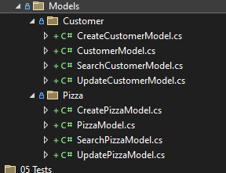
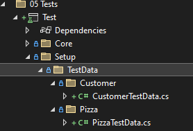
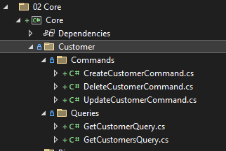

# &nbsp;**Pezza - Phase 2 - Step 1**

<br/><br/>

This Phase might feel a bit tedious, but it puts down a strong foundation to build off from for the entire incubator.

If at any point you are struggling you can reference Phase 2\src\02. EndSolution

## **Install Mediatr**

To help us with CQRS we will be using the Mediatr Nuget package. 

What is Mediatr?
In-process messaging with no dependencies.

Supports request/response, commands, queries, notifications and events, synchronous and async with intelligent dispatching via C# generic variance.

Install Mediatr on the Core Project and your Common Project


## **Create the other database entities and update database context**

### **Entities**

Representing Database Tables Entities


```cs
namespace Common.Entities;

public sealed class Customer
{
	public int Id { get; set; }

	public string Name { get; set; }

	public string Address { get; set; }

	public decimal Email { get; set; }

	public decimal Cellphone { get; set; }

	public DateTime DateCreated { get; set; }
}
```

```cs
namespace Common.Entities;

public sealed class Pizza
{
	public int Id { get; set; }

	public string Name { get; set; }

	public string Description { get; set; }

	public decimal Price { get; set; }

	public DateTime DateCreated { get; set; }
}
```

### **Models**

Create Models for each Entity. For seperation of concern we will create seperate Models for each action. Can also be copied from **Phase 2\src\02. EndSolution\Common\Models**



Add Customer to Mapper.cs

```cs
namespace Common.Mappers;

[Mapper]
public static partial class Mapper
{
	public static partial PizzaModel Map(this Pizza pizza);

	public static IEnumerable<PizzaModel> Map(this List<Pizza> pizzas)
		=> pizzas.Select(x => x.Map());

	public static partial Pizza Map(this PizzaModel pizza);

	public static IEnumerable<Pizza> Map(this List<PizzaModel> pizzas)
		=> pizzas.Select(x => x.Map());

	public static partial CustomerModel Map(this Customer pizza);

	public static IEnumerable<CustomerModel> Map(this List<Customer> pizzas)
		=> pizzas.Select(x => x.Map());

	public static partial Customer Map(this CustomerModel pizza);

	public static IEnumerable<Customer> Map(this List<CustomerModel> pizzas)
		=> pizzas.Select(x => x.Map());
}
```

### **Unit Tests Test Data**




### **Database EFCore Maps**

Add CustomerMap.cs to Mapping folder


```cs
namespace DataAccess.Mapping;

using Microsoft.EntityFrameworkCore;
using Common.Entities;

public sealed class CustomerMap : IEntityTypeConfiguration<Customer>
{
	public void Configure(Microsoft.EntityFrameworkCore.Metadata.Builders.EntityTypeBuilder<Customer> builder)
	{
		builder.ToTable("Customer", "dbo");

		builder.HasKey(t => t.Id);

		builder.Property(t => t.Id)
			.IsRequired()
			.HasColumnName("Id")
			.HasColumnType("int")
			.ValueGeneratedOnAdd();

		builder.Property(t => t.Name)
			.IsRequired()
			.HasColumnName("Name")
			.HasColumnType("varchar(100)")
			.HasMaxLength(100);

		builder.Property(t => t.Address)
			.HasColumnName("Address")
			.HasColumnType("varchar(500)")
			.HasMaxLength(500);

		builder.Property(t => t.Email)
			.HasColumnName("Email")
			.HasColumnType("varchar(500)")
			.HasMaxLength(500);

		builder.Property(t => t.Cellphone)
			.HasColumnName("Cellphone")
			.HasColumnType("varchar(50)")
			.HasMaxLength(50);

		builder.Property(t => t.DateCreated)
			.IsRequired()
			.HasColumnName("DateCreated")
			.HasColumnType("datetime")
			.HasDefaultValueSql("(getdate())");
	}
}
```

Update DatabaseContext.cs

```cs
namespace DataAccess;

using Common.Entities;
using DataAccess.Mapping;
using Microsoft.EntityFrameworkCore;

public class DatabaseContext : DbContext
{
	public DatabaseContext()
	{
	}

	public DatabaseContext(DbContextOptions options) : base(options)
	{
	}

	public virtual DbSet<Customer> Customers { get; set; }

	public virtual DbSet<Pizza> Pizzas { get; set; }

	protected override void OnModelCreating(ModelBuilder modelBuilder)
	{
		modelBuilder.ApplyConfiguration(new CustomerMap());
		modelBuilder.ApplyConfiguration(new PizzaMap());
	}

	protected override void OnConfiguring
	   (DbContextOptionsBuilder optionsBuilder) => optionsBuilder.UseInMemoryDatabase(databaseName: "PezzaDb");
}

```

### **Business Logic - Core**

We will be moving to CQRS pattern for the Core Layer. This helps Single Responsibility.

[CQRS Overview](https://docs.microsoft.com/en-us/azure/architecture/patterns/cqrs)

To help us out achieving this we will be using a Nuget Package - Mediatr

[Mediatr](https://github.com/jbogard/MediatR)

To create consistency with the result we send back from the Core layer we will utilize a Result.cs class. This helps to create unity between all Commands and Queries.

## **Common Models**

Instead of throwing or using exceptions, we will return a Result object indicating success or failure of an operation.

```cs
namespace Common.Models;

using System.Collections.Generic;
using System.ComponentModel;
using System.Linq;

public class Result
{
	public Result()
	{
	}

	internal Result(bool succeeded, string error)
	{
		this.Succeeded = succeeded;

		this.Errors = new List<object>
		{
			error
		};
	}

	internal Result(bool succeeded, List<object> errors)
	{
		this.Succeeded = succeeded;
		this.Errors = errors;
	}

	internal Result(bool succeeded, List<string> errors)
	{
		this.Succeeded = succeeded;
		this.Errors = errors.ToList<object>();
	}

	public bool Succeeded { get; set; }

	public List<object> Errors { get; set; }

	public static Result Success() => new Result(true, new List<object> { });

	public static Result Failure(List<object> errors) => new Result(false, errors);

	public static Result Failure(List<string> errors) => new Result(false, errors);

	public static Result Failure(string error) => new Result(false, error);
}

public class Result<T>
{
	internal Result(bool succeeded, string error)
	{
		this.Succeeded = succeeded;
		this.Errors = new List<object>
		{
			error
		};
	}

	internal Result(bool succeeded, List<object> errors)
	{
		this.Succeeded = succeeded;
		this.Errors = errors;
	}

	internal Result(bool succeeded, T data, List<object> errors)
	{
		this.Succeeded = succeeded;
		this.Errors = errors;
		this.Data = data;
	}

	public bool Succeeded { get; set; }

	public T Data { get; set; }

	public List<object> Errors { get; set; }

	public static Result<T> Success(T data) => new Result<T>(true, data, new List<object> { });

	public static Result<T> Failure(string error) => new Result<T>(false, error);

	public static Result<T> Failure(List<object> errors) => new Result<T>(false, errors);
}

public class ListResult<T>
{
	internal ListResult(bool succeeded, string error)
	{
		this.Succeeded = succeeded;
		this.Errors = new List<object>
		{
			error
		};
	}

	internal ListResult(bool succeeded, List<object> errors)
	{
		this.Succeeded = succeeded;
		this.Errors = errors;
	}

	internal ListResult(bool succeeded, List<T> data, int count, List<object> errors)
	{
		this.Succeeded = succeeded;
		this.Errors = errors;
		this.Data = data;
		this.Count = count;
	}

	internal ListResult(bool succeeded, IEnumerable<T> data, int count, List<object> errors)
	{
		this.Succeeded = succeeded;
		this.Errors = errors;
		this.Data = data.ToList();
		this.Count = count;
	}

	public bool Succeeded { get; set; }

	public List<T> Data { get; set; }

	public List<object> Errors { get; set; }

	public int Count { get; set; }

	public static ListResult<T> Success(List<T> data, int count) => new ListResult<T>(true, data, count, new List<object> { });

	public static ListResult<T> Success(IEnumerable<T> data, int count) => new ListResult<T>(true, data, count, new List<object> { });

	public static ListResult<T> Failure(string error) => new ListResult<T>(false, error);

	public static ListResult<T> Failure(List<object> errors) => new ListResult<T>(false, errors);
}

public class ListOutcome<T>
{
	public List<T> Data { get; set; }

	public int Count { get; set; }

	public List<string> Errors { get; set; }
}

public class ErrorResult : Result
{
	public ErrorResult() => this.Succeeded = false;

	[DefaultValue(false)]
	public new bool Succeeded { get; set; }
}
```

Create the following Commands for Customer and Pizza in Core Project inside the Entity Name Folder/Commands <br/> 

We will move from PizzaCore concept now to seperate Command or Querie for each operation. It is important to start seeing the patterns here.

We will also be using the new Models relevant to each operation.

- Create Command

```cs
namespace Core.Pizza.Commands;

using System.Threading;
using System.Threading.Tasks;
using Common.Mappers;
using Common.Models;
using DataAccess;
using MediatR;

public class CreatePizzaCommand : IRequest<Result<PizzaModel>>
{
	public CreatePizzaModel? Data { get; set; }

	public class CreatePizzaCommandHandler : IRequestHandler<CreatePizzaCommand, Result<PizzaModel>>
	{
		private readonly DatabaseContext databaseContext;

		public CreatePizzaCommandHandler(DatabaseContext databaseContext)
			=> this.databaseContext = databaseContext;

		public async Task<Result<PizzaModel>> Handle(CreatePizzaCommand request, CancellationToken cancellationToken)
		{
			if(request.Data == null)
			{
				return Result<PizzaModel>.Failure("Error creatiing a Pizza");
			}

			var entity = new Common.Entities.Pizza
			{
				Name= request.Data.Name,
				Description= request.Data.Description,
				Price = request.Data.Price,
				DateCreated = DateTime.UtcNow
			};
			this.databaseContext.Pizzas.Add(entity);
			var result = await this.databaseContext.SaveChangesAsync();

			return result > 0 ? Result<PizzaModel>.Success(entity.Map()) : Result<PizzaModel>.Failure("Error creatiing a Pizza");
		}
	}
}
```

- Delete Command

```cs
namespace Core.Pizza.Commands;

using System.Threading;
using System.Threading.Tasks;
using MediatR;
using Microsoft.EntityFrameworkCore;
using Common.Models;
using DataAccess;

public class DeletePizzaCommand : IRequest<Result>
{
	public int? Id { get; set; }

	public class DeletePizzaCommandHandler : IRequestHandler<DeletePizzaCommand, Result>
	{
		private readonly DatabaseContext databaseContext;

		public DeletePizzaCommandHandler(DatabaseContext databaseContext)
			=> this.databaseContext = databaseContext;

		public async Task<Result> Handle(DeletePizzaCommand request, CancellationToken cancellationToken)
		{
			if (request.Id == null)
			{
				return Result.Failure("Error deleting a Pizza");
			}

			var query = EF.CompileAsyncQuery((DatabaseContext db, int id) => db.Pizzas.FirstOrDefault(c => c.Id == id));
			var findEntity = await query(this.databaseContext, request.Id.Value);
			if (findEntity == null)
			{
				return Result.Failure("Pizza not found");
			}

			this.databaseContext.Pizzas.Remove(findEntity);
			var result = await this.databaseContext.SaveChangesAsync();

			return result > 0 ? Result.Success() : Result.Failure("Error deleting a Pizza");
		}
	}
}
```

- Update Command

```cs
namespace Core.Pizza.Commands;

using System.Threading;
using System.Threading.Tasks;
using Common.Mappers;
using Common.Models;
using DataAccess;
using MediatR;
using Microsoft.EntityFrameworkCore;

public class UpdatePizzaCommand : IRequest<Result<PizzaModel>>
{
	public int? Id { get; set; }

	public UpdatePizzaModel? Data { get; set; }

	public class UpdatePizzaCommandHandler : IRequestHandler<UpdatePizzaCommand, Result<PizzaModel>>
	{
		private readonly DatabaseContext databaseContext;

		public UpdatePizzaCommandHandler(DatabaseContext databaseContext)
			=> this.databaseContext = databaseContext;

		public async Task<Result<PizzaModel>> Handle(UpdatePizzaCommand request, CancellationToken cancellationToken)
		{
			if (request.Data == null || request.Id == null)
			{
				return Result<PizzaModel>.Failure("Error updating a Pizza");
			}

			var model = request.Data;
			var query = EF.CompileAsyncQuery((DatabaseContext db, int id) => db.Pizzas.FirstOrDefault(c => c.Id == id));
			var findEntity = await query(this.databaseContext, request.Id.Value);
			if (findEntity == null)
			{
				return Result<PizzaModel>.Failure("Error finding a Pizza");
			}

			findEntity.Name = !string.IsNullOrEmpty(model?.Name) ? model?.Name : findEntity.Name;
			findEntity.Description = !string.IsNullOrEmpty(model?.Description) ? model?.Description : findEntity.Description;
			findEntity.Price = model.Price.HasValue ? model.Price.Value : findEntity.Price;

			var outcome = this.databaseContext.Pizzas.Update(findEntity);
			var result = await this.databaseContext.SaveChangesAsync();

			return result > 0 ? Result<PizzaModel>.Success(findEntity.Map()) : Result<PizzaModel>.Failure("Error updating a Pizza");
		}
	}
}
```

If a property is not required and can be empty, don't enclose it in a shorthand if or coalescing.

```cs
findEntity.Description = request.Data?.Description;
```

Create the following Queries

We will be using [Compiled Queries](https://learn.microsoft.com/en-us/dotnet/framework/data/adonet/ef/language-reference/compiled-queries-linq-to-entities) for performance benefit.

-Get Single

```cs
namespace Core.Pizza.Queries;

using System.Threading;
using System.Threading.Tasks;
using Common.Mappers;
using Common.Models;
using DataAccess;
using MediatR;
using Microsoft.EntityFrameworkCore;

public class GetPizzaQuery : IRequest<Result<PizzaModel>>
{
	public int Id { get; set; }

	public class GetPizzaQueryHandler : IRequestHandler<GetPizzaQuery, Result<PizzaModel>>
	{
		private readonly DatabaseContext databaseContext;

		public GetPizzaQueryHandler(DatabaseContext databaseContext)
			=> this.databaseContext = databaseContext;

		public async Task<Result<PizzaModel>> Handle(GetPizzaQuery request, CancellationToken cancellationToken)
		{
			var query = EF.CompileAsyncQuery((DatabaseContext db, int id) => db.Pizzas.FirstOrDefault(c => c.Id == id));
			return Result<PizzaModel>.Success((await query(this.databaseContext, request.Id)).Map());
		}
	}
}
```

- Get All

```cs
namespace Core.Pizza.Queries;

using System.Linq;
using System.Threading;
using System.Threading.Tasks;
using Common.Mappers;
using Common.Models;
using DataAccess;
using MediatR;
using Microsoft.EntityFrameworkCore;

public class GetPizzasQuery : IRequest<ListResult<PizzaModel>>
{
	public class GetPizzasQueryHandler : IRequestHandler<GetPizzasQuery, ListResult<PizzaModel>>
	{
		private readonly DatabaseContext databaseContext;

		public GetPizzasQueryHandler(DatabaseContext databaseContext)
			=> this.databaseContext = databaseContext;

		public async Task<ListResult<PizzaModel>> Handle(GetPizzasQuery request, CancellationToken cancellationToken)
		{
			var entities = this.databaseContext.Pizzas.Select(x => x).AsNoTracking();

			var count = entities.Count();
			var paged = await entities.ToListAsync(cancellationToken);

			return ListResult<PizzaModel>.Success(paged.Map(), count);
		}
	}
}
```

Now, add the Commands and Queries for Customer Entity.

Core Project should look this when you are done.



Update DependencyInjection.cs - to include the new DataAccess and CQRS Classes

For MediatR Dependency Injection we need to create 3 Behaviour Classes inside Common

- PerformanceBehaviour.cs this will pick up any slow running queries

```cs
namespace Common.Behaviour;

using System.Diagnostics;
using System.Threading.Tasks;
using MediatR;
using Microsoft.Extensions.Logging;

public class PerformanceBehaviour<TRequest, TResponse> : IPipelineBehavior<TRequest, TResponse>
{
	private readonly Stopwatch timer;
	private readonly ILogger logger;

	public PerformanceBehaviour(ILogger logger)
		=> (this.timer, this.logger) = (new Stopwatch(), logger);

	public async Task<TResponse> Handle(TRequest request, RequestHandlerDelegate<TResponse> next, CancellationToken cancellationToken)
	{
		this.timer.Restart();

		var response = await next();

		this.timer.Stop();

		var elapsedMilliseconds = this.timer.ElapsedMilliseconds;

		if (elapsedMilliseconds > 500)
		{
			var requestName = typeof(TRequest).Name;
			this.logger.LogInformation($"CleanArchitecture Long Running Request: {requestName} ({elapsedMilliseconds} milliseconds)", request);
		}

		return response;
	}
}
```

- UnhandledExceptionBehaviour.cs this will pick up any exceptions during the executio pipeline.

```cs
namespace Common.Behaviour;

using System;
using System.Threading.Tasks;
using MediatR;
using Microsoft.Extensions.Logging;

public class UnhandledExceptionBehaviour<TRequest, TResponse> : IPipelineBehavior<TRequest, TResponse>
{
	private readonly ILogger<TRequest> logger;

	public UnhandledExceptionBehaviour(ILogger<TRequest> logger) => this.logger = logger;
	

	public async Task<TResponse> Handle(TRequest request, RequestHandlerDelegate<TResponse> next, CancellationToken cancellationToken)
	{
		try
		{
			return await next();
		}
		catch (Exception ex)
		{
			var requestName = typeof(TRequest).Name;

			this.logger.LogError(ex, "Pezza Request: Unhandled Exception for Request {Name} {@Request}", requestName, request);

			throw;
		}
	}
}
```


DependencyInjection.cs in Core

```cs
namespace Core;

using Common.Behaviour;
using Core.Customer.Commands;
using MediatR;
using Microsoft.Extensions.DependencyInjection;

public static class DependencyInjection
{
	public static IServiceCollection AddApplication(this IServiceCollection services)
	{
		services.AddMediatR(cfg => cfg.RegisterServicesFromAssemblyContaining<CreateCustomerCommand>());
		services.AddTransient(typeof(IPipelineBehavior<,>), typeof(UnhandledExceptionBehaviour<,>));
		services.AddTransient(typeof(IPipelineBehavior<,>), typeof(PerformanceBehaviour<,>));
		return services;
	}
}
```

### **Remove Core.Contracts Project**


## **STEP 2 - Unit Tests**

Move to Step 2
[Click Here](https://github.com/entelect-incubator/.NET/tree/master/Phase%202/Step%202)